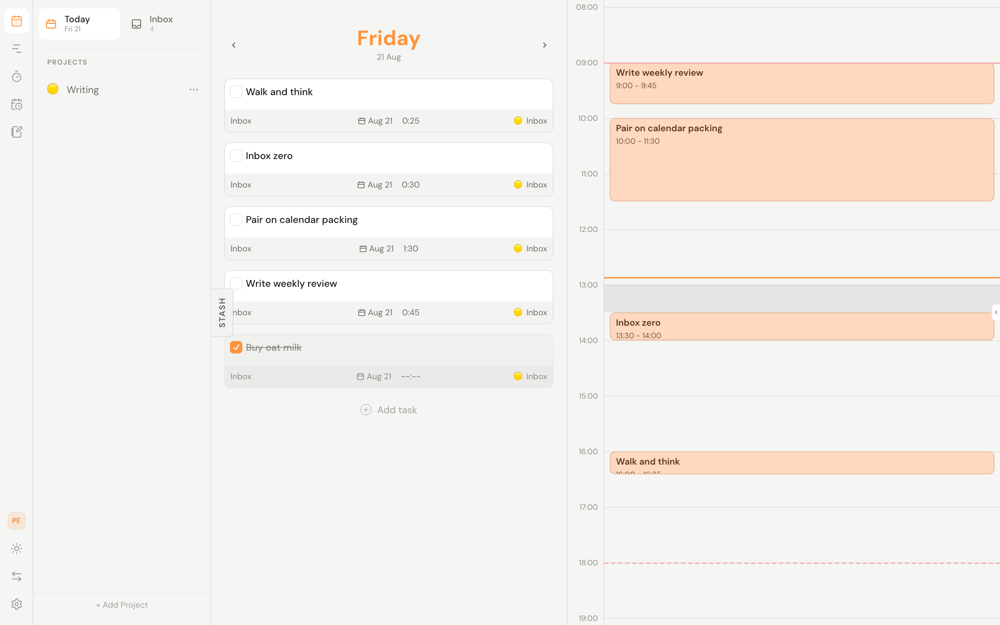
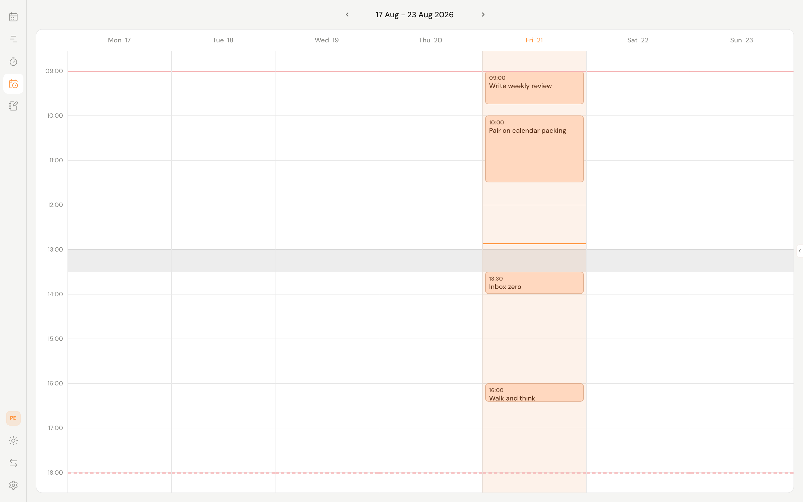
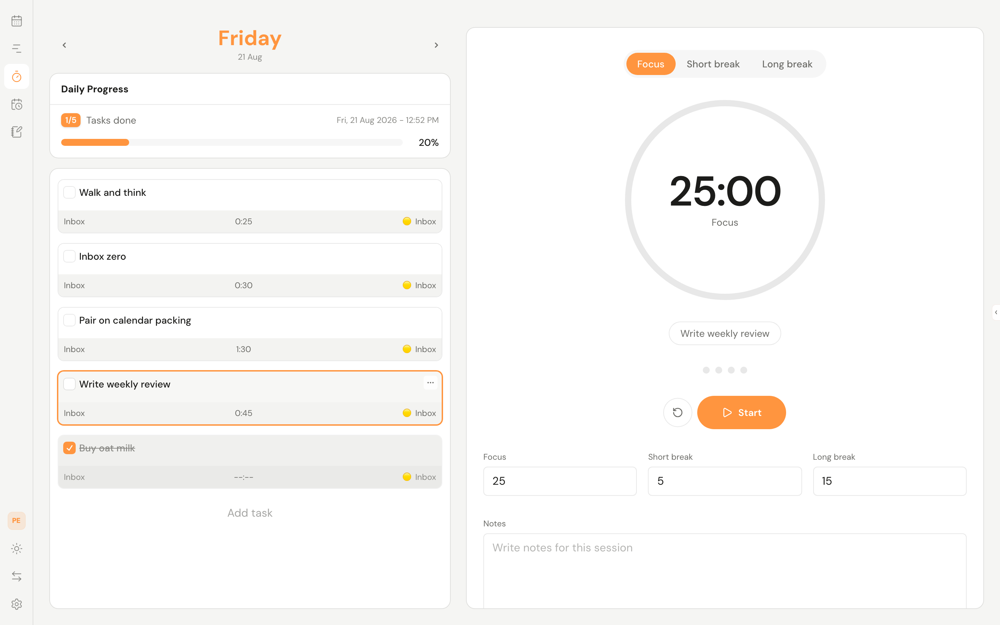
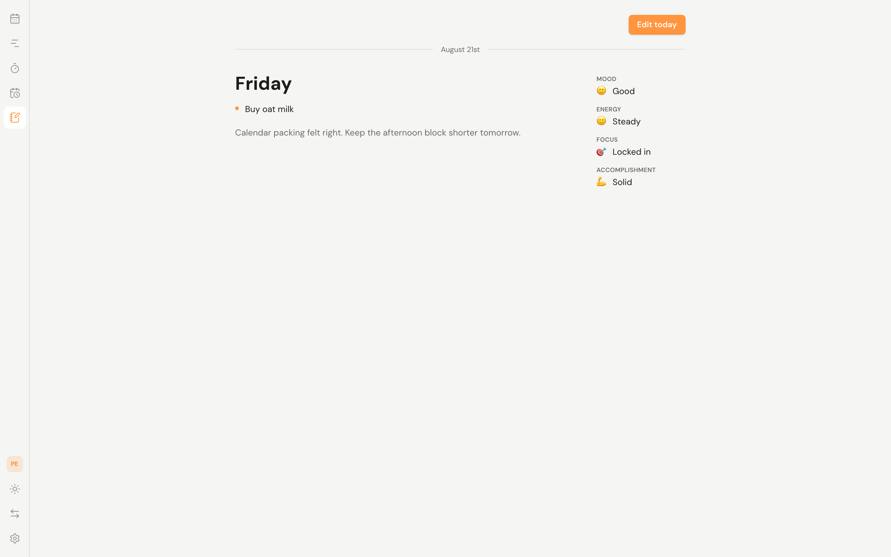
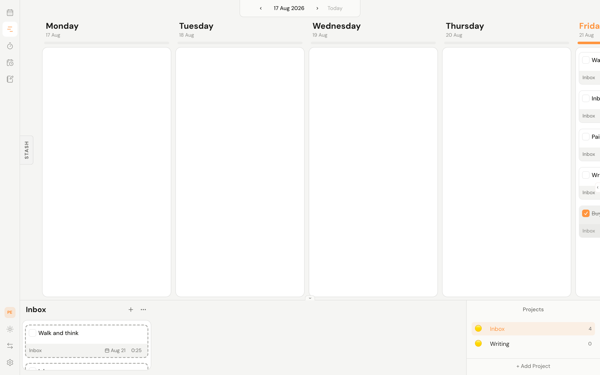
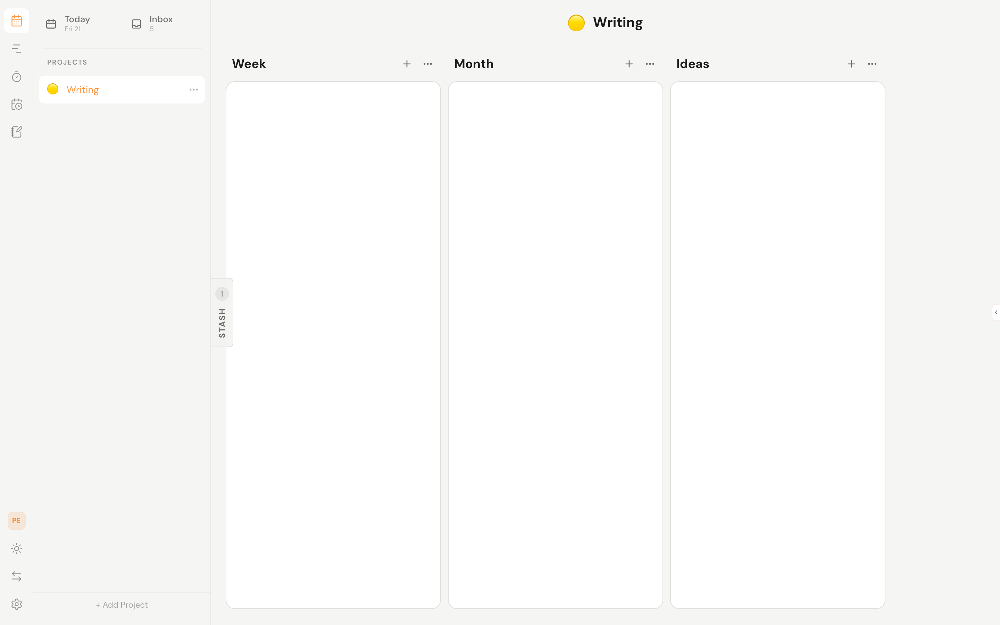

# Will Be Done

**A local-first daily planner: today's list, a time grid, a weekly calendar, pomodoro, and an end-of-day report.**

This is a fork of [will-be-done/will-be-done](https://github.com/will-be-done/will-be-done). The original is an offline-first weekly planner. This fork keeps that core and adds the day-to-day loop I actually run: pick the work, drop it on a clock, focus with a timer, then shut the day down.

The workflow is short. Capture tasks in Inbox or a project. Pull a few onto Today. Give them a duration and a start time, and they land on the day's timeline and the weekly calendar. Stash holds whatever you want close without scheduling it. At night, Finish day stores the completed tasks plus mood, energy, focus, and accomplishment.

It is still local-first. Tasks stay available offline, edits apply without a round trip, and sync catches up when the server is back. Startup reads from local storage on demand, so the app should open into your tasks instead of a spinner, even after years of history.

Under the hood it runs on [HyperDB](https://github.com/will-be-done/hyperdb), the original author's local-first database layer. Same typed domain logic in the browser and on the server.

[Try the live demo](https://demo.will-be-done.app) | [Use the cloud app](https://app.will-be-done.app/signup) | [Download desktop app](https://github.com/will-be-done/will-be-done/releases)



## Why this fork?

- **Plan the day on a clock.** Today is a list beside a timeline. Drag a task onto the grid and it gets a start time. Planned duration is on the task, not a separate calendar event.
- **See the week as time, not only as columns.** The calendar view is a Monday-start week with your work hours, breaks, and timed tasks.
- **Focus with pomodoro.** Pick a task from today's list, run 25/5/15 (or your own lengths), and keep notes on the session.
- **Shut the day down.** Finish day snapshots completed tasks, asks for four ratings, and keeps a note. One report per date.
- **Keep the original weekly planner.** Timeline, projects with sections, stash, and Vim keys are still there.
- **Stay useful offline.** Full local database, on-demand reads, real-time sync when you are connected.
- **Own the data.** Self-host with Docker and SQLite. No Redis, no hosted database required.

## Try it

- **Live demo:** [demo.will-be-done.app](https://demo.will-be-done.app). No sign-up required. Upstream demo of the original weekly planner.
- **Cloud app:** [app.will-be-done.app](https://app.will-be-done.app/signup).
- **Desktop app:** [download the latest upstream release](https://github.com/will-be-done/will-be-done/releases) for Windows, macOS, or Linux.
- **This fork:** clone and run locally (see Development). Mobile is the web app installed as a PWA.

## Screenshots

<table>
  <tr>
    <th>Today</th>
    <th>Calendar</th>
  </tr>
  <tr>
    <td width="50%">
      
    </td>
    <td width="50%">
      
    </td>
  </tr>
  <tr>
    <th>Pomodoro</th>
    <th>Daily report</th>
  </tr>
  <tr>
    <td width="50%">
      
    </td>
    <td width="50%">
      
    </td>
  </tr>
  <tr>
    <th>Weekly timeline</th>
    <th>Project</th>
  </tr>
  <tr>
    <td width="50%">
      
    </td>
    <td width="50%">
      
    </td>
  </tr>
</table>

## Available today

**The day**

- Today view: a dated list plus a time grid for that day.
- Planned duration on tasks (5 minutes through 8 hours).
- Start time on a scheduled task. Timed tasks show up on Today and on the calendar.
- Workday hours and breaks, set when you create a space or later in settings. The calendar paints those ranges so blocks sit inside the day you actually work.
- Weekly calendar: drag tasks onto hours, snap to 15 minutes.
- Pomodoro tied to today's tasks, with custom focus and break lengths.
- Daily reports: completed-task snapshot, notes, and ratings for mood, energy, focus, and accomplishment. One report per date.

**Task management**

- Create, edit, complete, move, reorder, and delete tasks.
- Descriptions and checklist items.
- Schedule to a date, schedule for today, or clear the schedule.
- Color/nature marker: red, green, or unmarked.

**Projects and planning**

- Projects with ordered sections.
- Drag between projects, sections, daily lists, and stash.
- Multiple spaces (work, personal, side projects).
- Inbox for capture.
- Stash as a persistent focus list from any page.
- Weekly timeline of day columns.

**Recurring tasks**

- Convert a task into a recurring template.
- Daily, weekly, monthly, and yearly rules, including custom intervals and weekdays.
- End never, after N occurrences, or on a date.

**Local-first speed**

- Full browser-side database.
- Read and write while offline.
- On-demand reads from persistent storage.
- Real-time sync across tabs and devices when connected.

**Keyboard and workflow**

- Vim keybindings for navigation and task actions.
- Drag and drop for tasks, days, projects, and sections.
- Desktop app with global quick add (upstream releases).
- Mobile-ready PWA.

**Import, backup, and ownership**

- Self-hosted server in one Docker command.
- SQLite by default, optional Turso Cloud or tursod.
- Todoist import by API token.
- TickTick import from CSV export.

## How Will Be Done will make money

The hosted cloud version will make money through paid plans. Self-hosting will never have a paywall. The original author promises that no feature in the self-hosted version will require payment to Will Be Done.

The self-hosted version will have the same features as the cloud unless a cloud feature cannot reasonably run without hosted infrastructure. In those cases, a self-hosted alternative is the plan. For example, a self-hosted AI assistant would use your own OpenRouter API key.

The standard setup uses SQLite and a directory for uploaded attachments. It does not require Redis, an external database service, or S3.

## HTTP API

Will Be Done has an HTTP API for your tasks, projects, schedules, daily reports, and other data.

- **Will Be Done Cloud:** [read the API documentation](https://app.will-be-done.app/api/docs).
- **Self-hosted with Docker:** open `/api/docs` on your server, for example
  [http://localhost:3000/api/docs](http://localhost:3000/api/docs).

### Create an API token

1. Sign in and open a space.
2. Open **Space Settings**, select **Tokens**, and click **Create token**.
3. Copy the new token and store it securely. Tokens remain active until you
   delete them from the same settings page.

Send the token as a Bearer credential:

```bash
curl \
  -H "Authorization: Bearer YOUR_TOKEN" \
  https://app.will-be-done.app/api/v1/spaces
```

Open the Scalar documentation in the same browser and on the same server
where you signed in, and it reuses the session token the web app already
stored. If there is no current token, enter one through Scalar's
**Authentication** controls.

## Self-host with Docker

Run the server:

```bash
docker run -d \
  -p 3000:3000 \
  -v will_be_done_storage:/var/lib/will-be-done \
  --restart unless-stopped \
  ghcr.io/will-be-done/will-be-done:latest
```

Then open http://localhost:3000 in your browser.

That image is the upstream release. This fork is the source in this repo. Build from the Dockerfiles here if you want the calendar, pomodoro, and daily reports.

The Docker server hosts the web app, stores server-side data under `/var/lib/will-be-done`, and syncs browser, PWA, and desktop clients. SQLite is the default; the API can optionally use Turso Cloud or the local Rust tursod service. See [the API database configuration](apps/api/README.md#database-engines) for setup instructions.

## Keyboard shortcuts

### Global quick add on Wayland

Electron's global shortcut portal may report a successful registration on some Wayland
compositors without delivering shortcut events. In that case, let the compositor handle
`Ctrl+Shift+A` and invoke the installed Will Be Done application with
`--show-quick-add`.

Use the command that matches the installed package:

- deb, rpm, or snap: `will-be-done --show-quick-add`
- Flatpak (optimized): `flatpak run --command=will-be-done-quick-add app.willbedone.WillBeDone`
- AppImage: `/absolute/path/to/will-be-done.AppImage --show-quick-add`

To quickly open or focus the main window from a Flatpak installation:

```bash
flatpak run --command=will-be-done-show app.willbedone.WillBeDone
```

For example, with a deb, rpm, or snap installation, add this entry to the `binds`
section of the niri configuration:

```kdl
Ctrl+Shift+A {
    spawn "will-be-done" "--show-quick-add";
}
```

Validate the niri configuration after editing it:

```bash
niri validate
```

Niri reloads valid configuration changes automatically.

For Hyprland using Lua configuration:

```lua
hl.bind(
    "CTRL + SHIFT + A",
    hl.dsp.exec_cmd("will-be-done --show-quick-add")
)
```

Replace the command portion of either compositor example when using Flatpak or AppImage.
The command starts Will Be Done when necessary. If it is already running, it forwards the
request to the existing process. Starting with `--show-quick-add` keeps the main window
hidden. Closing the main window also keeps Will Be Done running in the system tray, where
you can reopen the app, show Quick Add, or quit it completely.

### In app shortcuts

Global:

1. `\` - toggle stash
1. `v` - toggle task details panel
1. `p` - toggle project view
1. `z` - zen mode: close stash, task details, and project view

When a task is focused:

1. `i`, `enter` - enter insert mode to edit the task; `esc` exits insert mode
1. `j`, `k` - move between tasks
1. `h`, `l` - move between columns
1. `ctrl-j`, `ctrl-k`, `ctrl-down`, `ctrl-up` - move task up or down
1. `ctrl-h`, `ctrl-l`, `ctrl-left`, `ctrl-right` - move task left or right
1. `o` - create a task below the focused task
1. `O` - create a task above the focused task
1. `space` - toggle task state
1. `m` - move task to another project
1. `S` - stash task
1. `s` - schedule date
1. `t` - schedule task for today
1. `r` - reset schedule
1. `d`, `x`, `backspace` - delete task
1. `e` - edit task description
1. `c` - add checklist item
1. `a` - open action menu

When a project is focused:

1. `i` - edit project
1. `j`, `k` - move between projects
1. `d`, `x`, `backspace` - delete project

Reserved / WIP:

1. `u`, `cmd-z`, `ctrl-z` - undo action
1. `ctrl-r`, `cmd-shift-z`, `ctrl-shift-z` - redo action

## Roadmap

Done in this fork on top of upstream v1 work:

- [x] Repeating tasks
- [x] Task details
- [x] Checklists inside tasks
- [x] Todoist / TickTick migration
- [x] Desktop app with global quick add
- [x] OpenAPI integration
- [x] Planned duration and start time on tasks
- [x] Workday hours and breaks
- [x] Weekly calendar
- [x] Pomodoro
- [x] Daily reports

Still open:

- [ ] CLI app
- [ ] Undo / redo

Possible next features:

- [ ] Task comments
- [ ] Task attachments
- [ ] CalDAV integration
- [ ] MCP integration
- [ ] Project themes with custom backgrounds and task colors
- [ ] Global command palette
- [ ] Multi-select tasks
- [ ] Global themes
- [ ] Drag and drop for project columns
- [ ] Internationalization
- [ ] More Vim keybindings
- [ ] End-to-end encryption
- [ ] Global search
- [ ] Mobile widgets
- [ ] Notifications on web, mobile, and desktop
- [ ] Mobile app store builds (the web app packaged for iOS and Android)

Not planned for now:

1. Multi-user spaces or projects
1. Shared tasks, projects, or spaces

## Development

Install dependencies:

```bash
pnpm install
```

Run the API and web app in separate terminals:

```bash
pnpm dev:server
pnpm dev:client
```

Or run the combined terminal UI. When `WBD_DB_ENGINE=tursod`, it also starts
the Rust database service and configures the API to use it:

```bash
pnpm all
WBD_DB_ENGINE=tursod pnpm all
```

Useful checks:

```bash
pnpm ts
pnpm lint
pnpm test
pnpm test:e2e
```

## Why another task manager?

The upstream project exists because its author wanted a lifelong planner: fast with years of history, offline, self-hosted, keyboard-first, weekly columns, stash, desktop quick add, and an API.

This fork exists because I wanted the day as well as the week. A list without a clock is how I overcommit. A calendar without a task database is how I lose the work. Pomodoro without today's list is a timer in another tab. The daily report is the shutdown ritual so yesterday is not a blank column.

Super Productivity is still the closest self-hosted app I have used. Sunsama is the closest commercial daily planner. This repo is the weekly planner plus the daily loop, on the same local-first stack.

## Comparison

This table is the original feature set plus the daily-planning rows this fork adds. Other projects may have changed since it was written.

| Feature                                 | This fork | Will Be Done | Super Productivity | Donetick | Tududi | Vikunja | TaskTrove |
| --------------------------------------- | --------- | ------------ | ------------------ | -------- | ------ | ------- | --------- |
| Open source and self-hosted             | ✅        | ✅           | ✅                 | ✅       | ✅     | ✅      | ✅        |
| Fully usable offline                    | ✅        | ✅           | ✅                 | 🟥       | 🟥     | 🟥      | 🟥        |
| Drag and drop for tasks and projects    | ✅        | ✅           | ✅                 | 🟥       | 🟥     | ✅      | ✅        |
| Real-time refresh without manual reload | ✅        | ✅           | ✅ with SuperSync  | ✅       | 🟥     | 🟥      | 🟥        |
| Multi-tab support                       | ✅        | ✅           | 🟥                 | ✅       | 🟨     | 🟨      | 🟨        |
| API                                     | ✅        | ✅           | ✅ with SuperSync  | ✅       | ✅     | ✅      | ✅        |
| Mobile version                          | ✅        | ✅           | ✅                 | ✅       | ✅     | ✅      | ✅        |
| Keyboard shortcuts / Vim bindings       | ✅        | ✅           | ✅                 | ✅       | ✅     | ✅      | 🟨        |
| Weekly planner                          | ✅        | ✅           | ✅                 | 🟥       | 🟥     | 🟥      | 🟥        |
| Time-blocked calendar                   | ✅        | 🟥           | 🟨                 | 🟥       | 🟥     | 🟥      | 🟥        |
| Pomodoro                                | ✅        | 🟥           | ✅                 | 🟥       | 🟥     | 🟥      | 🟥        |
| Daily shutdown / ratings                | ✅        | 🟥           | 🟥                 | 🟥       | 🟥     | 🟥      | 🟥        |
| Sections or columns inside projects     | ✅        | ✅           | ✅                 | 🟥       | 🟥     | ✅      | ✅        |
| Desktop app with global quick add       | ✅        | ✅           | ✅                 | 🟥       | 🟥     | 🟥      | 🟥        |
| Local-first architecture                | ✅        | ✅           | ✅                 | 🟥       | 🟥     | 🟥      | 🟥        |

## Note on AI usage

The original author has been developing Will Be Done for more than a year (third attempt in three years). This fork uses that stack and adds the daily-planning views. I use Cursor to help with development, and I review the code before it lands.
