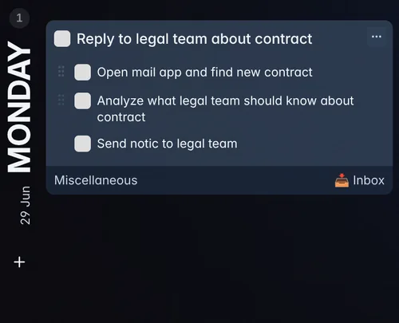
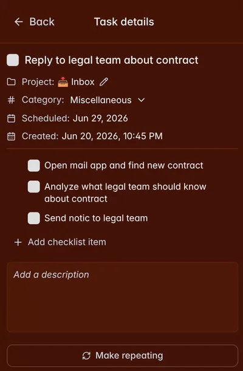
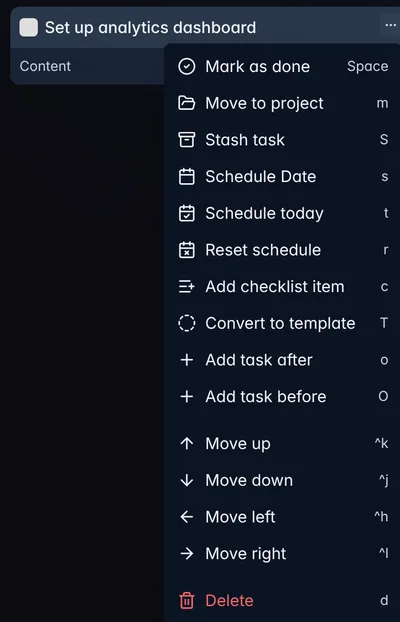
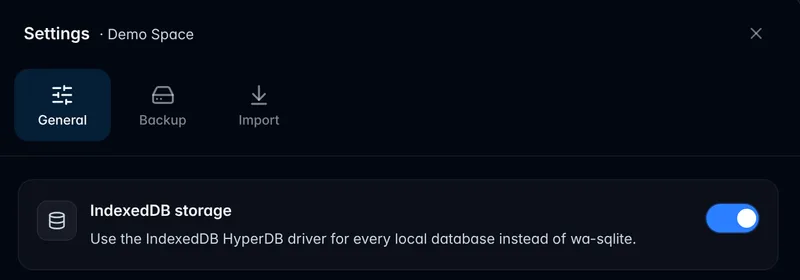

> **Please create a backup before upgrading.** This release includes a data migration, which should
> work automatically, but making a backup first is strongly recommended. You can create one in the
> settings of the currently opened space, under the "Backup" tab.

## What's new

- Task checklists are now supported, including in card details.

- Added a mobile card details page.

- Improved task action menu, including scrollbar support and Vim-style navigation.

- Added timeline and project polish, including indicators for tasks that are already scheduled.
- Added PWA update notifications with an improved update toast.
- Card editing has been improved with debounced saving.
- Project clicks now open the project page.

## Technical improvements

- Migrated the app to the packaged [HyperDB](https://github.com/will-be-done/hyperdb) implementation.
- Added IndexedDB support for faster, more reliable local persistence. We recommend switching it on
  from the settings page; every new install uses IndexedDB by default.

- Added HyperDB devtools, including a mobile-friendly view.
- Improved app loading with router and data preloading.
- Improved sync, backup, stash drag-and-drop, tracing, and production deploy behaviour.
- Added Playwright end-to-end test support.
- Migrated CI workflows to Blacksmith.
- Improved Docker image size, CI reliability, and migrated to pnpm.
