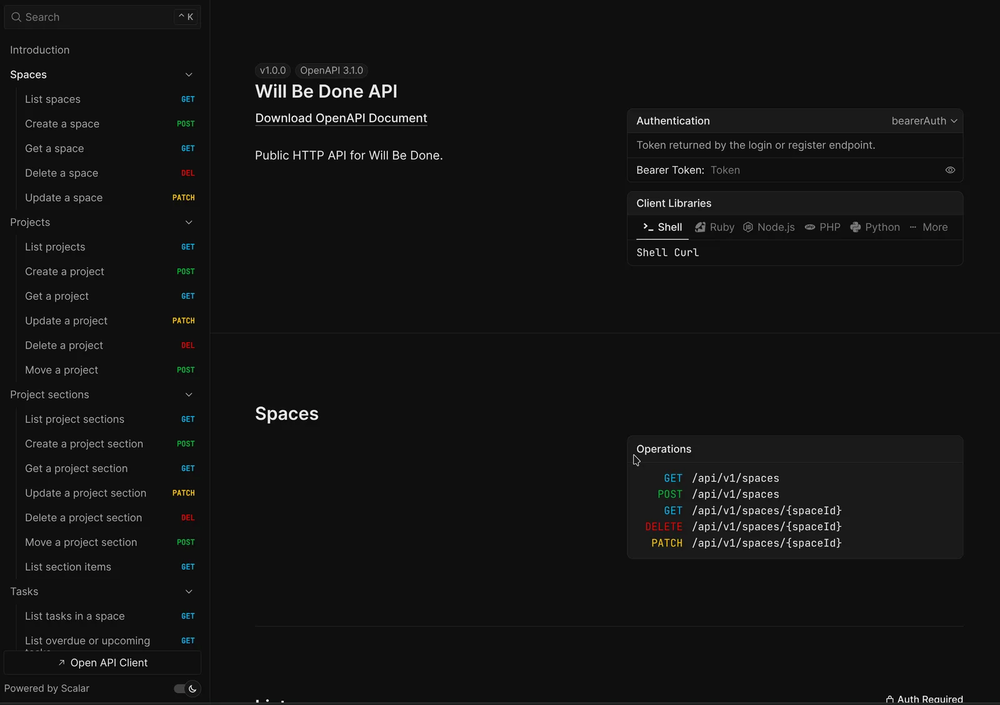

## What's new

### Public API and access tokens

Will Be Done now has a versioned HTTP API for scripts and integrations. Its 48 bearer-authenticated operations cover spaces, projects, project sections, tasks, task templates, checklists, daily lists, scheduled tasks, and the stash.

Create, inspect, copy, and revoke API tokens from Space Settings. Interactive API documentation is available at `/api/docs`. The OpenAPI document is available at `/api/openapi.json`.

Related PRs: [#76](https://github.com/will-be-done/will-be-done/pull/76), [#81](https://github.com/will-be-done/will-be-done/pull/81), [#82](https://github.com/will-be-done/will-be-done/pull/82).

[Check API doc](https://app.will-be-done.app/api/docs/#tag/spaces)

### Sync and storage reliability

Sync now uses protocol v4. It stages and checksums uploads and downloads, then applies each transfer atomically. The protocol recovers after lost responses and restored client or server backups. It also handles clock skew and permanent tombstones.

The storage model now uses project sections, items, and entries instead of categories, cards, and projections. Existing databases migrate when they open. The backup loader still accepts the older formats.

Related PRs: [#77](https://github.com/will-be-done/will-be-done/pull/77), [#79](https://github.com/will-be-done/will-be-done/pull/79), [#84](https://github.com/will-be-done/will-be-done/pull/84), [#88](https://github.com/will-be-done/will-be-done/pull/88).

### Database and deployment options

SQLite remains the default. Self-hosted installations can now use Turso Cloud or the new Rust-based `tursod` service.

This release also adds Redis-backed sync notifications, shared Redis rate limiting, and Fly.io deployment configurations. A guarded migration workflow moves existing SQLite data to `tursod`. API rate limits are enabled by default.

Related PRs: [#83](https://github.com/will-be-done/will-be-done/pull/83), [#87](https://github.com/will-be-done/will-be-done/pull/87).

### App and website changes

- Checklist rows now have an accessible delete action on desktop and touch devices. [#90](https://github.com/will-be-done/will-be-done/pull/90)
- Stashed tasks retain access to their details, with regression coverage added. [#91](https://github.com/will-be-done/will-be-done/pull/91)
- The Quick Add window no longer loads UI used only by the main app.
- Flatpak installations can open or focus the main window through `will-be-done-show`.
- Space deletion controls no longer lose clicks to card navigation.
- Daily-list restoration and legacy backup handling received more fixes.
- The landing site has clearer navigation and product information. [#92](https://github.com/will-be-done/will-be-done/pull/92)
- The landing site now has release pages, an RSS feed, structured metadata, and automated GitHub release syncing. [#93](https://github.com/will-be-done/will-be-done/pull/93)

## Upgrade notes

- Deploy the v0.11.0 web client and API together. The server accepts only sync protocol v4. Older clients must update before they can continue syncing.
- Existing SQLite installations need no new database configuration. Back up self-hosted data before the first v0.11.0 startup because storage migrations run when databases open.
- Multi-instance deployments should configure Redis so all API processes share rate limits and sync notifications.
- The existing S3 backup worker supports SQLite only. Use Turso backups for Turso Cloud. Back up the `tursod` data directory with a separate process.
