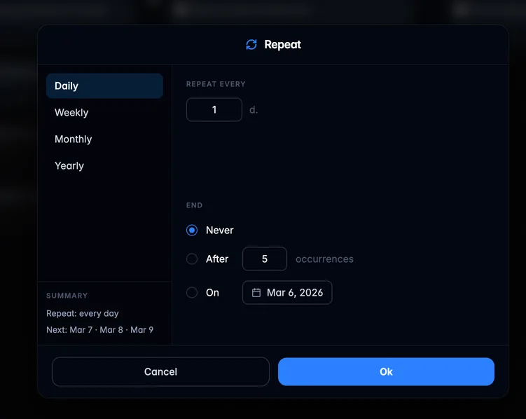
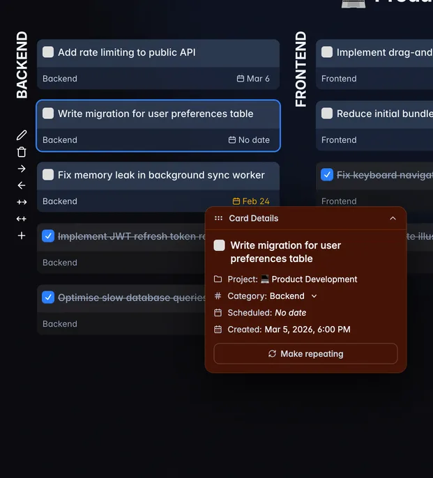

## What's changed

- Added repeatable tasks ([#18](https://github.com/will-be-done/will-be-done/pull/18)).

- Added a task details popup ([#18](https://github.com/will-be-done/will-be-done/pull/18)).

