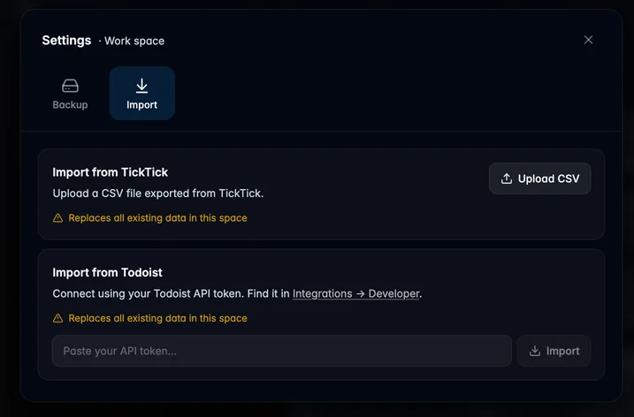

## What's changed

- Added TickTick import ([#22](https://github.com/will-be-done/will-be-done/pull/22)).
- Added Todoist import ([#24](https://github.com/will-be-done/will-be-done/pull/24)).

### Other changes

- Improved the navbar timeline and projects links ([#20](https://github.com/will-be-done/will-be-done/pull/20)).
- Added a settings modal ([#21](https://github.com/will-be-done/will-be-done/pull/21)).
- Removed the "horizon" column from the tasks table ([#23](https://github.com/will-be-done/will-be-done/pull/23)).
