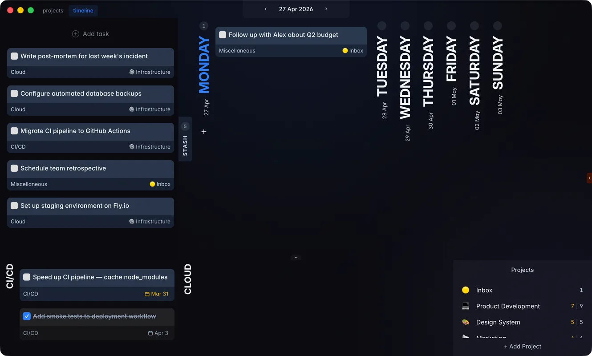
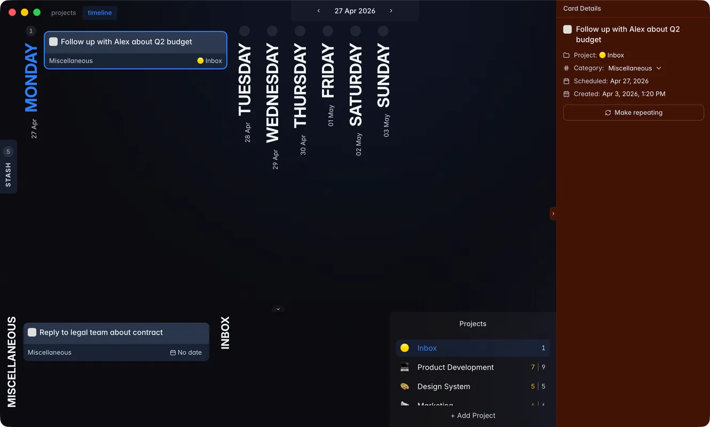

## What's changed

Added a Stash feature. You can now store tasks that don't have a specific date yet, allowing you to
keep them in focus until you're ready to tackle them.

Replaced the floating task window with a right sidebar. This new layout is much less annoying and
should make managing task details a lot smoother.

Fixed performance issues on Safari.

> Note: this release was originally intended to be version 0.8.0. However, a GitHub outage earlier
> that day caused issues with draft releases, necessitating a version change.
