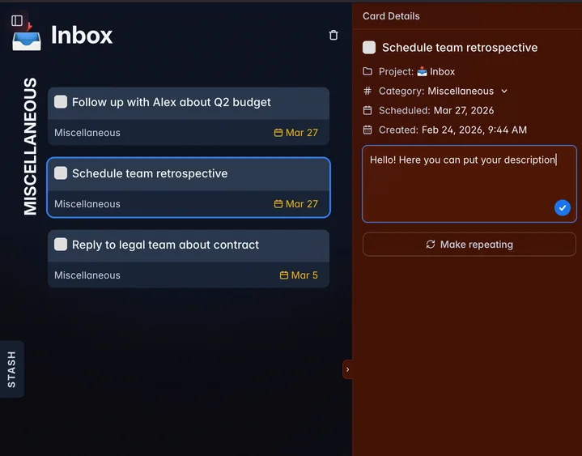

## What's changed

- Task descriptions now support markdown ([#39](https://github.com/will-be-done/will-be-done/pull/39)).

- Improved the sync code. It sometimes failed to trigger after the app had been asleep for a long time.
